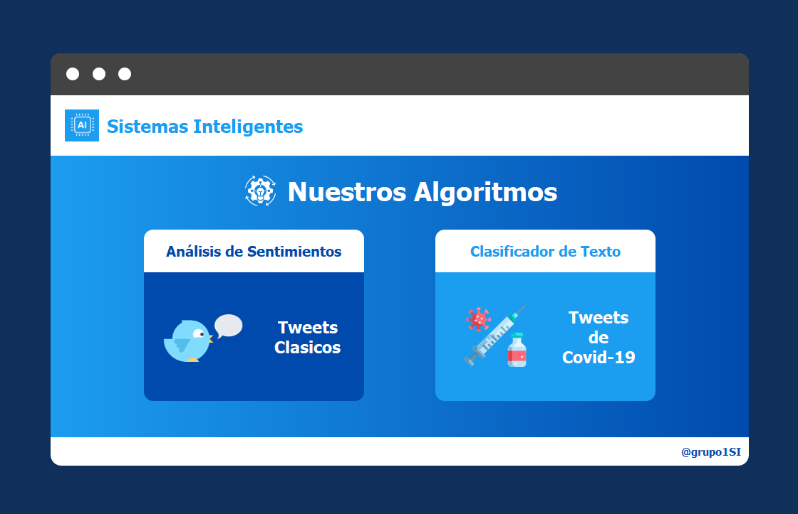
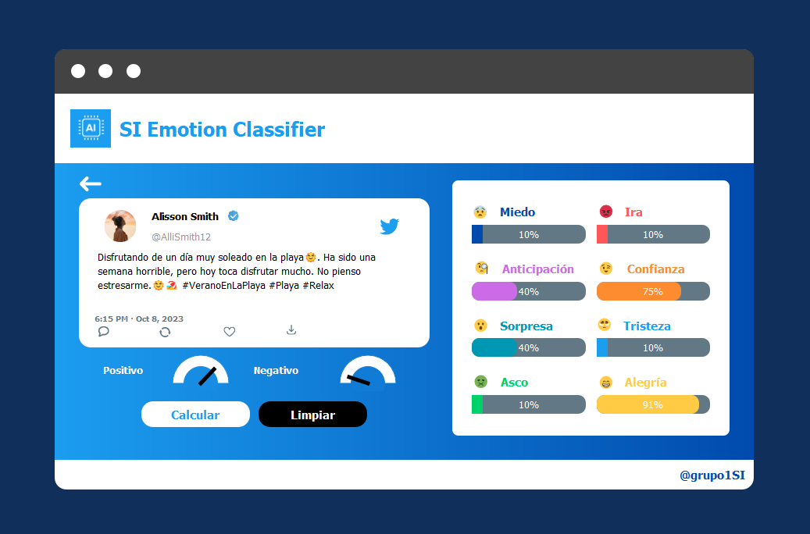
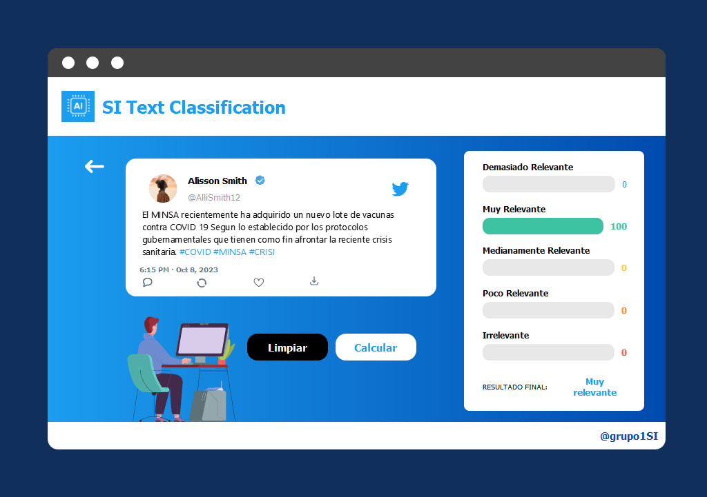

# Tweet Analyzer and Covid-19 Text Classifier
## Overview
This project is a Python-based program with a graphical user interface developed using QtDesigner. The main interface consists of two sections: Classic Tweets (Sentiment Analysis) and Covid-19 Text Classifier.

  

### Classic Tweets (Sentiment Analysis)
In this section, the program evaluates the sentiment of a given tweet and provides insights into the emotions expressed. The sentiment analysis categorizes the emotions into eight categories: Fear, Anger, Anticipation, Trust, Surprise, Sadness, Disgust, and Joy. The program calculates the percentage of intensity for each emotion and presents a graph indicating whether the overall sentiment of the tweet is positive or negative.

  

### Covid-19 Text Classifier
The second section focuses on analyzing tweets related to Covid-19. By inputting the message of a tweet, the program measures the level of importance it represents in relation to the topic of Covid-19. The results are presented as percentages and categorized into five levels: Too Relevant, Very Relevant, Moderately Relevant, Slightly Relevant, and Irrelevant. The final result reflects the highest relevance level obtained from the individual results.

  

## Libraries
- re
- emoji
- spacy
- string
- numpy
- spacy
- nltk
- copy
- math
- nrclex
- googletrans
- skfuzzy 

